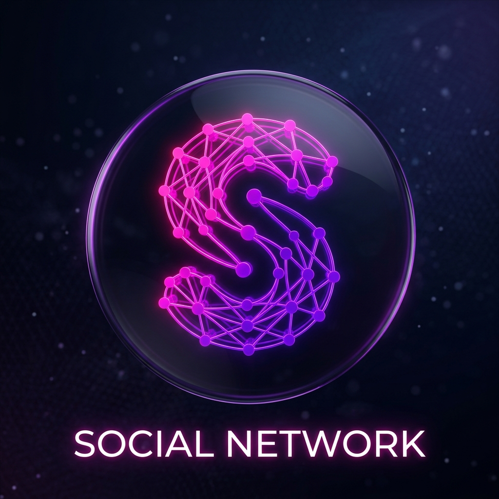
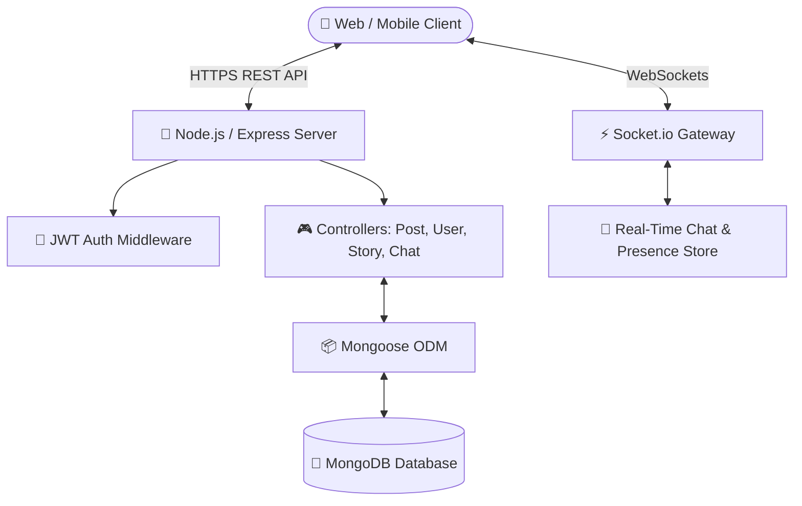

<div align="center">

  

  # ⚡ Social Network — Next-Gen Social & Community Platform

  **A modern, full-stack social platform engineered for real-time connection, story sharing, interactive media feeds, and deep community engagement.**

  [](https://reactjs.org/)
  [](https://vitejs.dev/)
  [](https://nodejs.org/)
  [](https://expressjs.com/)
  [](https://www.mongodb.com/)
  [](https://socket.io/)
  [](LICENSE)

  <br />

  

</div>

---

## 📖 Overview

**Social Network** reimagines the social networking experience with a ultra-sleek **3D Glassmorphism & Neon Midnight** aesthetic, lightning-fast real-time messaging via Socket.io, interactive 24-hour story reels, post engagement analytics, and deep creator discovery tools.

Featuring floating translucent UI cards, glowing status rings, live typing indicators, and particle reaction dynamics, **Social Network** delivers a premium web experience across mobile and desktop devices.

---

## 🎨 Design & Aesthetic Highlights

- 🔮 **Futuristic Glassmorphism**: Translucent frosted cards with vibrant neon purple/magenta borders and soft ambient shadows.
- ⭕ **Glowing Status & LIVE Rings**: Dynamic animated story rings around creator avatars indicating active status and live streams.
- 💥 **Heart & Emoji Reactions**: Double-tap particle bursts, quick emoji reaction drawers (`😍`, `👍`, `⭐`), and animated engagement counters.
- 💬 **Floating Message Panels**: Low-latency direct messaging interface complete with typing notifications and read receipts (`Sent ✓`, `Delivered ✓✓`, `Seen ✓✓`).

---

## 🌟 Key Features

| Feature Area | Description | Highlights |
| :--- | :--- | :--- |
| 📸 **Posts & Media Feed** | Expressive content publishing with image uploads and rich captions. | Double-tap heart particle bursts, comment drawers, bookmark collections, and post editing. |
| ⭕ **24-Hour Stories** | Ephemeral multimedia story reels with active ring indicators. | Segment progress bar animations, viewer analytics lists, and instant emoji quick-reactions. |
| 💬 **Real-Time Messaging** | Low-latency chat engine powered by WebSockets (`Socket.io`). | Online/offline presence indicators, live typing indicators, delivery/read receipts, image attachments, and message reactions. |
| 🔍 **Explore & Discovery** | Multi-faceted discovery engine. | Instant user search, hashtag filter chips, suggested creators carousel, and trending post feeds. |
| 📊 **Creator Analytics** | Comprehensive post performance metrics. | Impressions, unique reach calculation, total interactions, and engagement rate graphs. |
| 🔒 **Privacy & Controls** | Granular user account privacy settings. | Private accounts, follow request workflows, custom notification filters, and session control. |

---

## 🛠 Tech Stack

### **Frontend Architecture**
- **Framework**: React 18 + Vite
- **Styling**: Modern Vanilla CSS with CSS Variables, Glassmorphism, Custom Keyframe Animations
- **Icons**: `lucide-react`
- **Real-Time Client**: `socket.io-client`
- **Routing**: `react-router-dom` v6

### **Backend Architecture**
- **Runtime**: Node.js v18+
- **Framework**: Express.js
- **Database**: MongoDB with Mongoose ODM
- **Real-Time Gateway**: Socket.io (WebSocket protocol with HTTP long-polling fallback)
- **Authentication**: JSON Web Tokens (JWT) stored in HTTP-Only cookies / Authorization headers
- **Media Storage**: Cloudinary / Local Multer Storage integration

---

## 🏗 System Architecture



---

## 🚀 Quick Start Guide

### Prerequisites
- **Node.js**: v18.x or higher
- **npm** or **yarn**
- **MongoDB**: Local MongoDB instance or MongoDB Atlas Connection URI

---

### 1. Clone the Repository
```bash
git clone https://github.com/anuragsinghrajput123456789/The-Social-Network.git
cd The-Social-Network
```

---

### 2. Backend Setup & Run

```bash
# Navigate to backend directory
cd backend

# Install dependencies
npm install

# Create environment file from template
cp .env.example .env

# Start backend server
npm start
```
*The backend server will run on `http://localhost:3000` by default.*

---

### 3. Frontend Setup & Run

```bash
# Navigate to frontend directory
cd ../frontend

# Install dependencies
npm install

# Create environment file from template
cp .env.example .env

# Start Vite development server
npm run dev
```
*The frontend client will run on `http://localhost:5173`.*

---

## 🌐 Environment Variables Configuration

### Backend (`/backend/.env`)
```env
PORT=3000
NODE_ENV=development
MONGO_URI=mongodb+srv://<username>:<password>@cluster.mongodb.net/socialnetwork
CORS_ORIGIN=http://localhost:5173

# Optional Media Upload Config
CLOUDINARY_CLOUD_NAME=your_cloud_name
CLOUDINARY_API_KEY=your_api_key
CLOUDINARY_API_SECRET=your_api_secret
```

### Frontend (`/frontend/.env`)
```env
VITE_API_BASE_URL=http://localhost:3000
```

---

## 📁 Directory Structure

```
The-Social-Network/
├── 📂 doc/                     # In-depth architectural & technical specifications
│   ├── 🖼️ assets/             # Logos, banners, & visual media assets
│   ├── 📄 API_FLOW.md          # REST API endpoints & payload blueprints
│   ├── 📄 ARCHITECTURE.md     # Component design & state machine documentation
│   ├── 📄 CASE_STUDY.md        # Technical decisions & performance metrics
│   └── 📄 DEEP_DIVE.md         # Comprehensive system implementation details
├── 📂 backend/                 # Express REST API & Socket.io server
│   ├── 📂 config/              # Database connection & third-party setup
│   ├── 📂 controllers/         # Request handlers (User, Post, Chat, Story)
│   ├── 📂 middleware/          # JWT authentication & error handling
│   ├── 📂 models/              # Mongoose schemas (User, Post, Story, Message)
│   ├── 📂 routes/              # Express API route modules
│   └── 📄 app.js               # Main application entry point
├── 📂 frontend/                # Vite + React single-page application
│   ├── 📂 src/
│   │   ├── 📂 components/      # UI components (Feed, Chat, Stories, Sidebar)
│   │   ├── 📂 context/         # Auth & Socket global React state
│   │   ├── 📂 pages/           # Application views (Home, Profile, Messages)
│   │   └── 📂 services/        # API client layer & Axios instances
│   └── 📄 vite.config.js       # Vite build configuration
├── 📄 DEPLOYMENT.md            # Production deployment guide (Render/Vercel)
└── 📄 README.md                # Project documentation home
```

---

## 📚 Technical & Architectural Documentation

Detailed deep-dive technical documentation is available inside the [`/doc`](doc/) directory:

- 🔗 [**API Flow & Route Specifications**](doc/API_FLOW.md)
- 🔗 [**System Architecture & State Flow**](doc/ARCHITECTURE.md)
- 🔗 [**Engineering Case Study**](doc/CASE_STUDY.md)
- 🔗 [**Deep Dive Implementation Blueprint**](doc/DEEP_DIVE.md)
- 🔗 [**Deployment & Hosting Guide**](DEPLOYMENT.md)

---

## 🤝 Contributing

Contributions, issues, and feature requests are welcome!  
Feel free to check the [issues page](https://github.com/anuragsinghrajput123456789/The-Social-Network/issues) if you want to contribute.

1. Fork the Project
2. Create your Feature Branch (`git checkout -b feature/AmazingFeature`)
3. Commit your Changes (`git commit -m 'Add some AmazingFeature'`)
4. Push to the Branch (`git push origin feature/AmazingFeature`)
5. Open a Pull Request

---

## 📄 License

Distributed under the **MIT License**. See `LICENSE` for more information.

<div align="center">
  <sub>Built with ❤️ for deep community connections and real-time social experiences.</sub>
</div>
